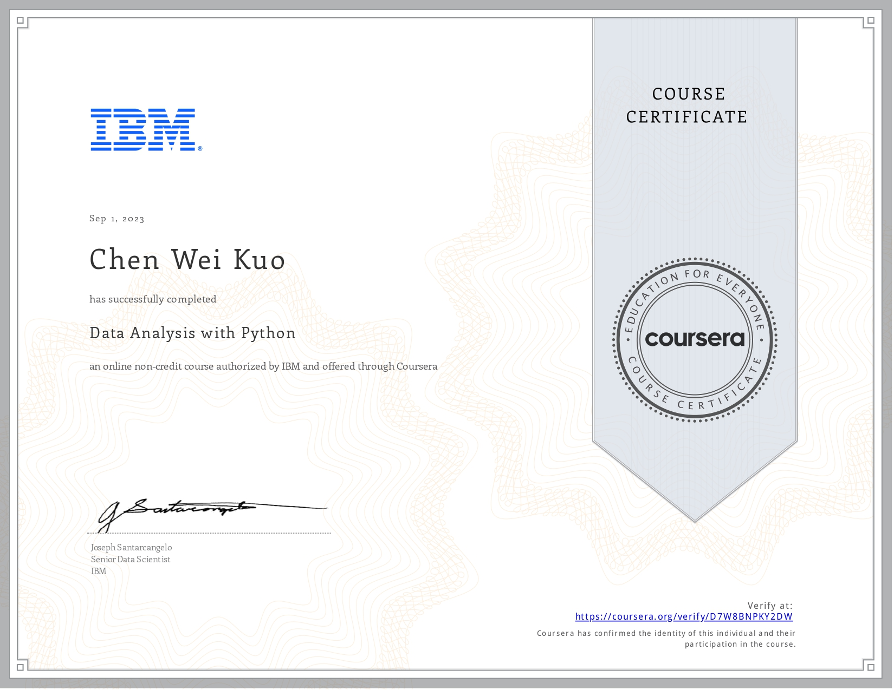

# coursera-ibm-data-science-capstone
## Course Overview
This is a IBM Data Science Professional Certificate Capstone Project. The course is offered by IBM on Coursera.  
### Tools Used
- **Jupyter / JupyterLab:** Engage in interactive computing and data visualization.
- **GitHub:** Master version control and collaborative development practices.
- **R Studio:** Utilize a powerful integrated development environment for R programming.
- **Watson Studio:** Explore cloud-based data science and machine learning solutions.

### Libraries Employed
- **Pandas**
- **NumPy**
- **Matplotlib**
- **Seaborn**
- **Folium**
- **ipython-sql**
- **Scikit-learn**
- **ScipPy**
- And more...

### Project Highlights
1. **Financial Data Analysis:**
   - Extract and visualize financial data using the Pandas Python library.

2. **SQL Data Querying:**
   - Utilize SQL to query diverse datasets, including census, crime, and school demographic data.

3. **Predictive Modeling for Housing Prices:**
   - Apply data wrangling techniques, graph plots, and create regression models to predict housing prices using Python data science libraries.

4. **Dynamic Python Dashboard:**
   - Develop a dynamic dashboard in Python for monitoring, reporting, and improving US domestic flight reliability.

5. **Machine Learning Applications:**
   - Predict loan repayment using and comparing various machine learning classification algorithms.
   - Evaluate and compare machine learning models for predicting the reusability of the first stage of a rocket in space launches.

### Skills Implemented in the Course

- **Data Science:** Master the principles and practices of data science.
- **Big Data:** Explore handling and analyzing large datasets.
- **Python Programming:** Develop proficiency in Python for data science applications.
- **GitHub:** Learn version control and collaborative coding practices.
- **Machine Learning:** Apply and evaluate machine learning algorithms.
- **Deep Learning:** Gain insights into deep learning methodologies.
- **Methodology:** Understand and apply robust data science methodologies.
- **SQL:** Use SQL for efficient data querying.
- **R Studio:** Explore advanced analytics and visualization using R.
- **Data Mining:** Develop skills for extracting meaningful patterns from data.
- **Jupyter Notebooks:** Utilize interactive notebooks for data exploration and analysis.

Below are the certificates of completion for the course.

## Certificates
### IBM Data Science Professional Certificate

### What is Data Science?

### Tools for Data Science

### Data Science Methodology

### Python Project for Data Science

### Python for Data Science, AI & Development

### Data Analysis with Python

### Data Visualization with Python

### Machine Learning with Python

### Databases and SQL for Data Science

### Applied Data Science Capstone

